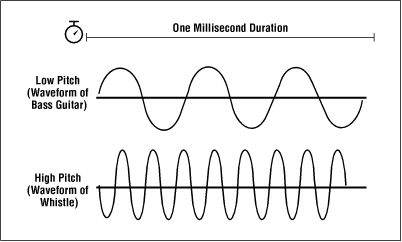
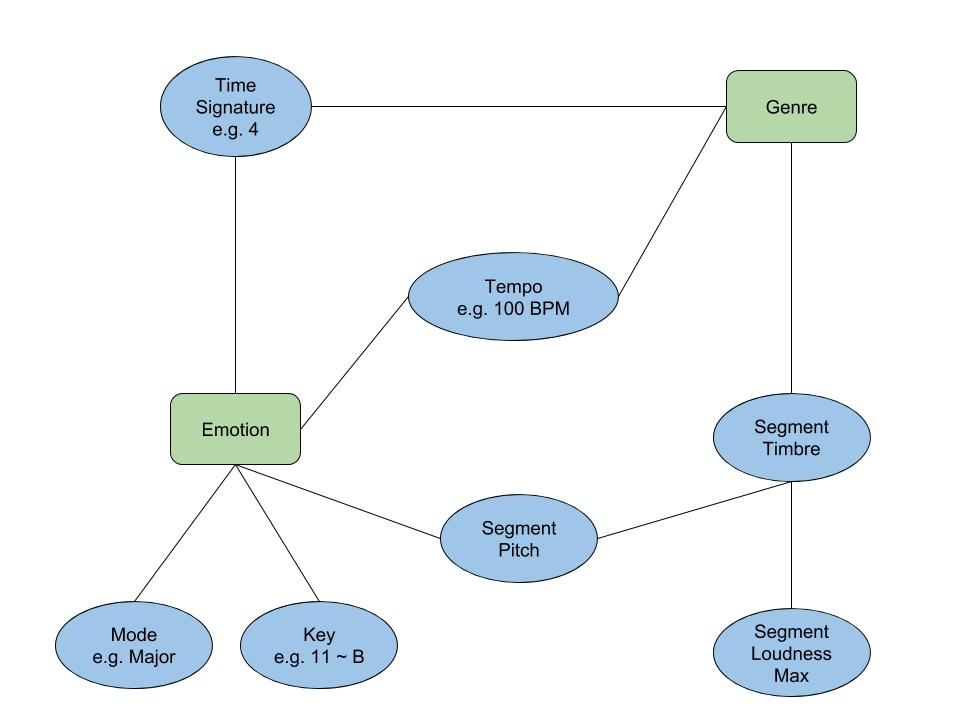

```{r setup, include=FALSE}
knitr::opts_chunk$set(echo = TRUE)
<<<<<<< HEAD
setwd('/Users/a.gogohia')
=======
setwd('/Users/Kostja/Desktop/Master/Sem 2 (18 SoSe)/Data Visualization/Tasks/DV_Project_2/')
>>>>>>> f5cdde9b62ed82caf2e02a872b67dcb932990d1a
```

# Introduction
As required, this task was an open one, so the students had to choose a specific topic on their own. Our group did choose a dataset we found on https://labrosa.ee.columbia.edu/millionsong/pages/getting-dataset#subset. This subset contains 10k music files and is around 2GB. The actual dataset is about 300GB and has around 1 million entries. In this case these are songs. Besides the analysis, the dataset includes some metadata, like the author, the year of production and so forth. As its center piece it features music data for each song in HDF5 format. The actual provider of this data set is THE ECHO NEST (http://the.echonest.com), which used to be a music intelligence and data platform for developers until Spotify (https://www.spotify.com/de/), a famous music streaming provider, acquired The Echo Nest.[^wiki1]
As provided by the information about the dataset, it is a result of an collaboration between THE ECHO NEST and LabROSA (https://labrosa.ee.columbia.edu). [^Labinfo1]

Our goal is going to be an analysis of specific files of our favorite songs. Since all of the music files are labeled with artist- and songnames, as well as the year of production, we were able to find almost every song either on YouTube (https://www.youtube.com) or on Spotify (https://www.spotify.com/de/). 
After selecting our prefered songs, we are going to analyze these songs to get a good understanding of the data that describes our preference. Lastly we are going to use Spotify for recommendation. As a result we hope for a more thorough analysis and understanding of the given data. This step is needed to find similar songs fast and take them as a basis to compare the data with our chosen songs.

Alongside with the above analysis our goal is to get some more general information about the artists and their songs. Therefore we are going to visualize general information as well. 

[^wiki1]: https://en.wikipedia.org/wiki/The_Echo_Nest page view [02.07.18]
[^Labinfo1]: https://labrosa.ee.columbia.edu/millionsong/ page view [02.07.18]


# Handle the downloaded data
After downloading and unzipping the data, one can see two different folders. The first one, 'data', containing several other folders and the second one 'AdditionalFiles', containing some adittional files in either SQL or txt format. The directory structure is based on The Echo Nest Track IDs [^echo1]. The 'data' folder contains exlusively songfiles in HDF5 (Hirarchical Data Format 5) format. This format is mostly used in science applications for big datasets. It was developed by NASA [^nasa] to handle large, heterogeneous and hirarchical datasets. The content of those files handles some analysis, some metadata and some more information that is stored on MusicBrainz (https://musicbrainz.org), an open music encyclopedia. The data available in 'AdditionalFiles' is going to be used for first hands on the whole dataset, to get to know the dataset since the access is simple. By doing so we will present some general information about the dataset. To read both datafolders one should install additional packages that will be mentioned later on.

For more information about the dataset, especially about the frequently asked questions we recommend to go to (https://labrosa.ee.columbia.edu/millionsong/faq). 

[^echo1]: TR+LETTERS + LETTERS&NUMBERS so the directory path within the dataset is based on the first 3 letters after the 3rd one e.i 'MillionSong/data/A/D/H/TRADHRX12903CD3866.h5'
[^nasa]: (National Aeronautics and Space Administration) https://www.nasa.gov/about/index.html page view [02.07.18]

## Preprocess the Additional files

When accessing the data provided in the 'AdditionalFiles' folder, one has to remove the seperators \<SEP\> and replace those with a common seperator like ';'. This should be done because R is used to an one byte seperator and therefore it is not possible to read a file with a seperator like \<SEP\>.

The following code snippet was only used to access the txt files in RStudio.

```{r importShow , warning=FALSE, echo=TRUE}
# Load preprocessed data and name the columns
location <- read.csv2('data/subset_artist_location.txt',sep = ';', header = FALSE, col.names = c('artistId', 'lat','lon',  'trackID', 'artistName'))
artists <- read.csv2('data/subset_unique_artists.txt',sep = ';', header = FALSE, col.names = c('artistId', 'V2', 'trackID', 'artistName'))
# tags <- read.csv2('data/subset_unique_mbtags.txt',sep = ';', header = FALSE, col.names = c('tags'))
# uni_terms <- read.csv2('data/subset_unique_terms.txt',sep = ';', header = FALSE, col.names = c('terms Unique' ))
tracks <- read.csv2('data/subset_unique_tracks.txt',sep = ';', header = FALSE, col.names = c('trackID','V2', 'artistName','songName'))
tracksPerYear <- read.csv2('data/subset_tracks_per_year.txt',sep = ';', header = FALSE,  col.names = c('Year', 'trackID', 'artistName','songName'))

```
# General information visualized

The following code loads the packages that are required to make a word cloud. Furthermore while creating a word cloud, one will notice that the first created word cloud has a very bad distribution. This occurs as of the usage of the most common words in the english language. Most of those words do not have a real meaning, they are rather filling words (stop words). Therefore, according to the observation and a wikipedia article [^wiki2], one should wipe out the dataset of these words. Thus, the recommendation is to use 'the','and' and 'a' to clean the dataset.

Describing the required packages, it is important to understand what each package is used for in the following code snippet. Starting with 'tm' (Text Mining Package), that is commonly used for word clouds and handling different strings. Firstly one should take a closer look at Corpus that creates a collaction of corpora [^Corpus1]. Secondly one should create a Vector Source for the Corpus function and finally tm_map, which is an Interface that applies transformation functions to corpora objects. Also a very important function content_transformer is used to create a wrapper to get and set a content of a document. These steps were taken to preprocess the documents. After doing so one should also consider to create a term document matrix, which contains every term in documents and the documents it appears in.

The package 'wordcloud' is a very useful one, and does provide a graphical representation of the frequencies of used words in one or more documents [^wordcl]. These word clouds can be seen in the following plots.

[^wiki2]: (https://en.wikipedia.org/wiki/Most_common_words_in_English) page view [26.06.18]
[^Corpus1]: (https://cran.r-project.org/web/packages/tm/tm.pdf) page view [26.06.18]
[^wordcl]: (https://cran.r-project.org/web/packages/wordcloud/wordcloud.pdf) page view [27.06.18]

## Visualize artisnames

```{r wordclodArtist, echo=TRUE, cache=TRUE, warning=FALSE}
# Load packages
library("tm") # for text mining
library("RColorBrewer") # color palettes
library("wordcloud") # word-cloud generator 

docs <- Corpus(VectorSource(as.String(artists$artistName)))

# Convert the text to lower case
docs <- tm_map(docs, content_transformer(tolower))

# most common words in english that do not have a meaning for this puposes
others <- c('the','and','a')

# convert the found words to ''
toSpace <- content_transformer(function (x , pattern ) gsub(pattern, " ", x))
for (i in 1:length(others)){
docs <- tm_map(docs, toSpace, others[i])
}

# calculate frequency of occuring words
dtm <- TermDocumentMatrix(docs)
m <- as.matrix(dtm)
v <- sort(rowSums(m),decreasing=TRUE)
d <- data.frame(word = names(v),freq=v)

wordcloud(words = d$word, freq = d$freq, min.freq = 1, scale = c(3,0.2),
          max.words=200, random.order=FALSE, rot.per=0.35, colors=brewer.pal(8, "Dark2"))
mtext('Artistnames', side = 2, line = 1, adj = 0.5) # title
```

When looking at the word cloud above, one can see that the most common artist names are either 'orchestra' or 'John'. Also there are some spanish artist names containing words like 'los'. This can be used to gain a greater knowledge about the dataset. It becomes more clear that artists do not only come from England, Europe or the US but also from Spain or Latin America. One could get rid of the prepositions in all languages the dataset contains. Thus the preposition 'los' should alse be wiped out.
Some other names like 'Joe' or 'King' are also quite commonly used. To make some more assumptions and to get a better understanding of the word cloud, the actual frequencies of the very frequent entries where provided in a table. 

```{r  headArtist, cache=TRUE, warning=FALSE}
# show only head of frequency dataFrame
head(d,8)
```

Together with this table and the word cloud one can gain a better understanding of the distribution of the artist names in the given dataset. Now it is interesting to get some more facts about the most common name 'John'. After a small research on the internet [research] one can see, that John was one of the most common names in the 1990's. To prove that this name occured mostly in the 1990's in the dataset one can take a closer look on the data of respective years.    

[^research]: (https://en.wikipedia.org/wiki/List_of_most_popular_given_names#Male_names_2) page view [23.06.18]

```{r tracksPerYear}
tracksPerYear$artistName[tracksPerYear$Year >= 1990 & tracksPerYear$Year <= 2000]
```
After displaying the actual dataset and the entries of the artist names between the years 1990 and 2000, the assumption made before should be declined. However one can see another common word in the displayed subset 'Los'. 
This set needs to be more described and explored, because the previous exploration does not provide a lot of information.

## Visualize songnames
Almost the same analysis was done on common song names. However the common words in this case were not quite the same as in the script before. The method we used to find common song names was to plot the word cloud as an  uncleaned version, containing all possible words. After deciding which words do not have a proper meaning to the final statement it was obvious to delete those words. Thus the cleaning with words like 'the','version','and','from', 'feat' and 'album' created the following word cloud.

```{r wordcloudSongname, warning=FALSE , cache=TRUE}
docs <- Corpus(VectorSource(as.character(tracks$songName)))

# Convert the text to lower case
docs <- tm_map(docs, content_transformer(tolower))

others <- c('the','version','and','from', 'feat','album')
toSpace <- content_transformer(function (x , pattern ) gsub(pattern, " ", x))
for (i in 1:length(others)){
docs <- tm_map(docs, toSpace, others[i])
}

dtm <- TermDocumentMatrix(docs)
m <- as.matrix(dtm)
v <- sort(rowSums(m),decreasing=TRUE)
d <- data.frame(word = names(v),freq=v)

wordcloud(words = d$word, freq = d$freq, min.freq = 1, 
          max.words=100, random.order=FALSE, rot.per=0.35, colors=brewer.pal(8, "Dark2"))
mtext('Songnames', side = 3, line = 0, adj = 0.5) # title
```

Looking at the result one can see the frequently words 'you' and 'love'. Interpreting this result, it is obvious that this dataset consists of song names that are more likely to address love and the counterpart of a human, you. A general assumption could be, that there are more songs addressing Love, the counterpart of someone and the life, following topics about the world or travelling for example. However this assumption can not be completely proven since this dataset does not represent all the song names in the world.  

Also by looking at the following table, one can have a better and more detailed information about the distribution of the song names.
```{r headSong, warning=FALSE , cache=TRUE}
head(d,7)
```

## Visualize artist locations

Since it is clear that the dataset not only contains artists from England or Europe or the US, it would be nice to have a proper plot of the world together with the location of the artists. This can be achieved through the package 'maps' [^map1]. This package provides not only a method to draw a map by accessing it through a word like world but also by giving this method a border by longitude and latitude to get a closer look on different parts of it. It is easy to use and draw complex maps as well as set some points on the map. The world map below shows all artists with their respective locations. Unfortinately the dataset does not provide a location for each artist, but nevertheless it creates a good overview. 

[^map1]: https://cran.r-project.org/web/packages/maps/maps.pdf page view [25.06.18]

<<<<<<< HEAD
#aggregate(tracksPerYear,by = tracksPerYear$artistName, FUN = sum)
unique(tracksPerYear$artistName)
=======
```{r worldmapArtist , warning=FALSE}
library(maps)

# parse the lat and lon values of given set 
lon <- as.double(as.character(location$lon))
lat <- as.double(as.character(location$lat))

# delete all NaN
lon <- lon[!is.na(lon)]
lat <- lat[!is.na(lat)]

coordinates <- as.data.frame(cbind(lon, lat))

# world map 
map('world',c('.'), col = "grey80", fill = TRUE, border = "grey40") 
points(coordinates$lon, coordinates$lat, col = "red", cex = .1)
<<<<<<< HEAD
>>>>>>> f5cdde9b62ed82caf2e02a872b67dcb932990d1a
=======
```
>>>>>>> 0311762973a0cba5bae40b6fff14e4023ab7404c

The assumptions about the artists made beforehand are completely right. The data not only consist of European and English speaking artist but also of people from around the world. Mostly the artists come from the US and Europe, some even from Russia or Australia or as assumed before from Latin America. By looking at the song names it is hard to tell wether the artist is from Australia or the US. With this representation one can have a better understanding of the dataset and finally clarify the unclarified.  

An even closer look on Europe is provided by the map below. Due to the blurred representation of Europe in the worldmap, this map was created. Especially because of the actual location of the author and the location of the university this representation was chosen. 

```{r europemapArtist, warning=FALSE}
# europe map
map(col = "grey80", border = "grey40", fill = TRUE,
  xlim = c(-25, 45), ylim = c(36, 70), mar = rep(0.1, 4))
points(coordinates$lon, coordinates$lat, col = "red", cex = .3)
```

# Analyse choosen Songs
As mentioned before the goal we set ourselves for this task, was to find similarities of favorite songs and to compare those to a recommendation made by Spotify. To achive this, one should be able to read in the provided data in HDF5 Format. Therefore, it is required to load the package 'rhdf5' [^package2] that helps accessing the data files and get the information to analize it. 
The chosen data is a preference of a person of our group. The songs he had chosen are ordered as followed:  <br />

- Beynonce Single Ladies TrackID: TRAPZTV128F92CAA4E  <br />

- Justin Timberlake What Goes Around Comes Around TrackID: TRANNZZ128F92C22F7  <br />

- Kanye West / Lupe Fiasco Touch The Sky TrackID: TRAQZQX128F931338F  <br />

- Madonna Jump TrackID: TRALONM128EF35A199  <br />

- B.o.B Nothin on You feat Bruno Mars TrackID: TRAWBHE12903CBC4CB  <br />

Taking the TrackID that functions also as the file name, one should first find out the right paths to the preferred files to access them. After creating the right path one should be able to access the data through some methods. As described below there are two methods to read in data. The first one is to access the groups with method h5ls() and the second one to access the data in those groups with method h5read(). One can see a slice of an output for h5ls() underneath.

[^package2]: load < source("http://bioconductor.org/biocLite.R"); biocLite("rhdf5") >

```{r createHDf5Files, warning=FALSE}
library(tcltk) # for interactive file choosing
library(rhdf5) # required for H5 files

# dynamic path 
# important to have the MIllion Song Data subset downloaded
# pathToSet <- tk_choose.dir(default = "", caption = "Select directory")

# set a hardcoded Path to the MillionSongSubset
pathToSet = '/Users/Kostja/Desktop/Master/Sem 2 (18 SoSe)/Data Visualization/Tasks/MillionSongSubset'

# create array with found Ids in beforehand containing prefered songs
TrackIDs <- array(c('TRAPZTV128F92CAA4E','TRANNZZ128F92C22F7','TRAQZQX128F931338F','TRALONM128EF35A199','TRAWBHE12903CBC4CB'))

# find automaticaly all paths with names of trackIDs
SubPaths <- lapply(TrackIDs,find.path <- function(x){
  list.files(pathToSet, x, recursive=TRUE, full.names=TRUE, include.dirs=TRUE)
})

# beautify the dataset 
SubPaths <- data.frame(SubPaths = t(unlist(SubPaths)))
names(SubPaths) <- c('beyonce', 'justin', 'kanye', 'madonna', 'bruno')

# read the H5 files and create a readable output
artist <- lapply(SubPaths, function(x){
  h5ls(toString(x))
})

head(artist$beyonce,23)
```

This snippet shows that there are different groups and even different subgroups one can access through h5read().
An example of the final data of Beyonce's song of group analysis and metadata can be seen underneath.

```{r readHDF5files, warning = FALSE}
Analyze_song <- apply(SubPaths,2,function(x){
  h5read(x,"/analysis/songs")
})
Analyze_song <- do.call(rbind, Analyze_song)

Meta_song <- apply(SubPaths,2,function(x){
  h5read(x,"/metadata/songs")
})
Meta_song <- do.call(rbind, Meta_song)

# will be used in PCA for ploting timbre
track_timbre <- apply(SubPaths,2,function(x){
  h5read(x,"/analysis/segments_timbre")
})

# will be used in PCA for ploting pitch
track_pitch <- apply(SubPaths,2,function(x){
  h5read(x,"/analysis/segments_pitches")
})
# example to show and see the entries of subgroups 
t(Analyze_song['beyonce',])
t(Meta_song['beyonce',])
```
Both tables will be used and combined on different variables. What also draws attention is the sparse vectors in the table above. Obviously one should get rid of those and just use the other variables for comparison.

First, one has to decide which variables one should take and what the meaning of those is. Second, it is important to decide which of those variables is comparable and where the similarities between the songs are. Hence, one needs to make further detailed analysis on the given data. Finally, one should be able to predict any given song if it fits the calculated results and the predicted song would be recommended to that person. 

## Data discription 
By looking at the data without any knowledge in beforehand, one should understand each an every variable. Since this has been done already, we will focus on the chosen variables and describe those. <br \>
Variables: <br \>

- Tempo: Indicates the speed of a beat and is also known as Beats per Minute (BPM). It is derived directly from avarage beat duration [^înfo2]. This is a basic unit of time in music. Now it is important to understand what exactly a beat is. To simplify the statement it is the rythm when a listener would tap his toe to a music sequence [^wiki3]. BPM Examples are 60 BPM would be a beat per second and 120 BPM would be 2 beats per second [^înfo1]. <br \>

- Loudness: This indicates the overall loudness of a track in decibels (dB) and is avaraged across a track in this dataset. The loudness is correlated with the physical strength   in the given dataset the loudness is averaged across a track [^înfo2]. <br \>

- Mode: In the theory of Western music, a mode is a type of musical scale coupled with a set of characteristic melodic behaviors. [^wiki4]. To simplify this statement a mode could be seen as the vocabulary of a melody. It specifies which notes can be used and indicates which have special importance [^înfo3]. Mostly major notes sound happy and minor notes do not [^spotify] <br \>

- Key: The key of a song refers to a tonal center of it and will also determine what notes and chords a song should use [^spotify]. The key also identifies the tonic triad, the chord, major or minor, which represents the final point of rest of a piece [^înfo2]. An example of a key could be C C# D E F G etc.<br \>

- Time Signature: The time signature, also known as meter signature, is a notational convention to specify how many beats are in each bar [^înfo2]. So now it is important to understand what exactly a bar is. A bar (or measure) is a segment of time corresponding to a specific number of beats in which each beat is represented by a particular note value and the boundaries of the bar are indicated by vertical bar lines [^wiki5].


 
 As can be seen in the picture above, a bar could be simplified through a vertical line in music notes. <br \>

- Segment Pitch: A pitch is a position of a single sound in the complete range of sound. Sounds are higher or lower in pitch according to the frequency of vibration of the sound waves producing them [^info4]. For a better understanding one should take a look on the further picture. But also one should have a better understanding of a segment. A segment is a set of sound entities, typically under a second, each relatively uniform in timbre and harmony. Segments are characterized by their perceptual onsets and duration in seconds, loudness (dB), pitch and timbral content [^înfo2].

 

<br \>
- Segment Timbre: Timbre is the quality of a musical note or sound that distinguishes different types of musical instruments, or voices. It is a complex notation also referred to as sound color, texture, or tone quality [^înfo2]. The Echo Nest Analyzer’s timbre feature is a vector that includes 12 unbounded values roughly centered around 0. This is represented as 12-dimensional vectors that are the principal components of Mel-frequency cepstral co- efficients (MFCCs). They represent the power spectrum of sound, and are derived from Fourier analysis and further processing [^doku4]. For completeness however, the first dimension represents the average loudness of the segment; second emphasizes brightness; third is more closely correlated to the flatness of a sound; fourth to sounds with a stronger attack; etc [^înfo2]. <br \>

- artist familiarity: Familiarity is an indication of how well known the artist is in 2010. [^famHot1]
- artist hotness: Hotness (which is spelled as the zoolanderish ‘hotttnesss’) is an indication of how much buzz the artist is getting  in 2010. [^famHot1]

[^wiki3]: https://en.wikipedia.org/wiki/Beat_(music) page view [04.07.18]
[^înfo1]: https://www.rhythm-in-music.com/introduction-beat-and-tempo.html page view [04.07.18]
[^înfo2]: http://docs.echonest.com.s3-website-us-east-1.amazonaws.com/_static/AnalyzeDocumentation.pdf page view [01.07.18]
[^wiki4]: https://en.wikipedia.org/wiki/Mode_(music) page view [01.07.18]
[^înfo3]: https://www.britannica.com/art/mode-music page view [04.07.18]
[^spotify]: https://insights.spotify.com/it/2015/05/06/most-popular-keys-on-spotify/ page view [04.07.18]
[^wiki5]: https://en.wikipedia.org/wiki/Bar_(music) page view [04.07.18]
[^info4]: https://www.britannica.com/art/pitch-music page view [04.07.18]
[^doku4]: http://www.ee.columbia.edu/~dliang/files/FINAL.pdf page view [06.07.18]
[^famHot1]: https://musicmachinery.com/2009/05/25/artist-similarity-familiarity-and-hotness/ page view [06.07.18]

### Describing relations between the variables

With all the provided information in the section above, one can derive a more specific representation of all the variables as well as a relationship between them. As can be seen below and also written in various articles, especially on Spotify, emotion is a very important characteristic of music. Most people listen to music when they are sad or happy or try to project their feelings on to it. Therefore, emotion does have specific role when talking about music [^spotify]. In addition to that there is also the genre of a song and even an artist, that depends on other variables. It is also a very important characteristic that can predict a listeners taste of music. Most people tend to listen to one or two particular genres. For sure there are more overall variables like emotion and genre, but for now we limit ourself to only those two.  



As provided by the image above, that was created by ourselves, the variables tend to describe the overall variables. Our research on the variables, led to this picture. Here one can see properly that the relationship for emotion does of course consist of all the variables, since the whole package of information does lead towards a proper and confident answer, but also it is highly dependent on the key and the mode. As mentioned in the section 'Data discription' especially the mode, mostly tends to describe either if the song is a happy one or not. Here one can see that key is a reliable source for measuring the emotion as well, since it correlates with the mode. Also the pitch is corresponding to one of the 12 keys and therefore, is a reliable source for emotions, too. 

#### ab hier muss korriegiert werden und anschließend diese Section weg
As can be seen in this image too, the tempo does indicate the emotion as well as the genre. Typically a higher tempo describes a more happy song and a genre like pop or techno or something similar. Also the time signature, which does rely on beat as well as the tempo could describe an emotion or a genre. Sigment Timbre however indicates more a genre than an emotion because it relies more on different types of musical instruments and some musical instruments do tend to be used in a particular genre like a guitar is common to use in Latin American songs. But together with the pitch, which uses the distribution of the keys, the timbre could be used to determine the emotion too. All of the previous can be seen in the image above. The background information does come from a research our group attended and can be reproduced with the sources and footnotes in the very last section. 

## Finding similarities

### General comparison

Since there is enough information about the chosen variables one should attend to get a better overview about the songs. Hence our group have chosen the following variables to compare the songs.

- Loudness 
- Tempo
- Mode
- Key

We created a radarplot using the package 'fmsb' [^fmsb]. This package is mostly used for medical and health analysis in R, but can also be used for this purposes to radarplot the characteristics of our data. Together with the method 'radarchart' one can plot a radar that creates a very good overview of the characteristics. In the following plot one can see some similarities of the choosen songs.


[^fmsb]: https://cran.r-project.org/web/packages/fmsb/fmsb.pdf page view [05.07.18]
```{r crateRadar, warning = FALSE }
library(fmsb) # for radar charts

# function takes a dataframe and concatenates it
radarFrame <- function(df2){
  matrix <- cbind('loudness' = df2$loudness,'tempo'= df2$tempo, 'mode' = df2$mode, 'key' = df2$key) 
  rownames(matrix) <- rownames(df2)
  matrix <- data.frame(matrix)
}

# creates a ArtistNameString out of dataframe information
namesLegend <- paste(Meta_song$artist_name,Meta_song$title)

# plots the radar, function wants to have a dataframe with the data to plot 
# artistnames for the legend as well as the optional coordinates where to plot the legend
radar <- function(df, namesLeg = namesLegend, x = -2.8 , y= -1.1){
  transparency <- adjustcolor(1:dim(df)[1], alpha.f = 0.2)
  # Custom the radarChart !
  radarchart( df  , axistype=1 , maxmin = FALSE,
    #custom polygon
    pcol=1:dim(df)[1], plwd=1 , pfcol = transparency ,
    #custom the grid
    cglcol="grey", cglty=1, axislabcol=FALSE ,
    #custom labels
    vlcex=0.8
    )
  par(xpd=TRUE) # legend outside the plot 
legend(x,y, legend = namesLeg, bty = "n", pch=20 , col=1:dim(df)[1] , cex=0.8, pt.cex=2)
}

#create Dataframe suited for radar
data <- radarFrame(Analyze_song)

# plot dataframe
radar(data)
```

Looking at the plotted characteristics one can not see a real dependency or even a realy good pattern. Mostly because the songs tend to be similar, since a listener prefers them, but not in all ploted variables. One could assume that key and tenpo tend to build clusters. Hence this variables will be taken for a closer look. Nevertheles all variables can be used to make assumptions for other statements. Also this variables are ploted relativle to each other and not with static dimensions. Therefor there will be a static plot provided.

The plot above will be compared with same variables for similar songs but on an other platform. The comparison platform is https://tunebat.com/. Tunebat seems to rely on spotify web API, where it accesses Spotify songs and creates similar charactaristics. The image below concretisises the dependencies and the hirarchical time line between the platforms. Thus the platform THE ECHO NEST was the first and was bought by and merged to spotify. Spotify provides an API that Tunebat uses.

 

It is not clear weather both platforms can be compared. The intention to compare the platforms did come up, because it would be better to have some more information about the songs regarding the emotion or the genre. So Tunebat provides those values. But first one should compare the given songs and find out if Tunebat could be used for such a comparison. 

What also should be mentioned before is that listening to those songs did get quite the same answers regarding the variables, besides the Justin Timberlake song. Our assumption was that the data in the MDS dataset for Justin Timberlake is not correct.

```{r compareTunebat, warning = FALSE}
# create radar chart from tunebat.com 
# loudness <- loudness
# tempo <- BPM
# mode <- KEY
# key <- KEY
compareFrame <- data.frame(rbind(
  beyonce = c( 'loudness ' = -5, 'tempo' = 97,'mode' = 0, 'key' = 11),
  justin = c( 'loudness ' = -5, 'tempo' = 76, 'mode' = 1, 'key' = 7),
  kanye = c('loudness ' = -5, 'tempo' = 106, 'mode' = 1,'key' = 9),
  madonna = c( 'loudness ' = -8, 'tempo' = 130, 'mode' = 0,'key' = 4),
  bruno = c( 'loudness ' = -6, 'tempo' = 104, 'mode' = 1, 'key' = 10)
))

{
# plot the two radarcharts together in one plot
par(mfrow = c(1,2))
radar(data,x=-2.2, y = -1.2)
radar(compareFrame,x=-2.2,  y = -1.2)
title('Comparison between MSD and Tunebat', outer = TRUE, line = -1)
par(mfrow = c(1,1))
}
```

When comparing the two platforms it seems that the songs do not have any similarities. This could be described through the song data. 

Artists do create songs, but sometimes there are many versions of those songs and it is hard to find the right one to compare them. Even if the songname is the same it could be modifyed. So in this case that explanation could fit, or simply that either the first or the second dataset is falsified. Since both platforms are not comparable the data from the second platform, Tunebat could be rejected. We will restrict ourseves only to the data provided from MSD. 


### Detailed comparrison

Since it is not possible to take a closer look on dancability or hapiness of a song, provided by tunebat, we restricted ourselves to the MSD dataset and the provided information in that data. However this information can be be approached through variables in the MSD dataset. Our focus will be on 'artist_familiarity', 'artist_hotnesss', 'key' and 'tempo'. 

The new strategie, since it is hard to compare the variables is, to take the prefered songs and the variables and to average them for further predictions and comparisons. First it would be nice to have a Barplot for each prefered song and each taken variable, as mentioned before.
```{r MSDBarplots, warning = FALSE}
# Overall Barplot function for any dataframe  
crateBarplotOfFrame <- function(x,y, NameP, rownames = FALSE){
  barplot(x[,y], main = y, col = 1:dim(x)[1], horiz = TRUE, names.arg= if(rownames){row.names(NameP)}else{names(NameP)}, cex.names=0.8, las = 1)
}

{
# Bar plots for MSD
par(mfrow =c(2,2))
crateBarplotOfFrame(Meta_song,'artist_familiarity', SubPaths)
crateBarplotOfFrame(Meta_song,'artist_hotttnesss', SubPaths)
crateBarplotOfFrame(Analyze_song,'tempo', SubPaths)
crateBarplotOfFrame(Analyze_song,'key', SubPaths)
title('Barplots for choosen songs and variables', outer = TRUE, line = - 15)
par(mfrow =c(1,1))
}
```

Now one can see directly the differences between each variable and each song. The given artist familiarity is quite similar. All artists are quite popular in 2010. This could also be a reason why one of our group members picked those songs. During that time he probably did go to a lot of discotheks and was probably listening a lot to this music. 

The hotness however does vary a lot especially for kanye west which outrages all other artist. This could be attributable through a new single that he maybe published in this year and therefore got all the buzz.

The tempo does also vary quite a lot and therefore it is hard to tell which tempo the listener prefers. He probably likes fast and happy songs more but also there is a more slower song. So he does listen to maybe sad music too. People listen to music to project their feelings on to it. This preferation could be used to profile the listener too. One could say that the listener mostly is a happy person but sometimes tends to be sad too.

The key in this case tends to be more in the higher sphere, what actually regards to the time the music was produced in. Since the 21th century music tend to be produced more Louder and mostly in G, which is a higher key.


### Spotify recommendation analysis
Since we did not wanted to pick some random musicfiles, we created a playlist on Spotify, which contained exactly the preferation of one of our groups member. Luckily Spotify provides some recommendation based on the actual playlist. We used this recommendation to get more interesting results for research purposes. However the used dataset did not provide all recommended music from spotify and we had to refresh the recommendations a couple of times to get the songs, which MSD contains. 

Finaly we found three different songs, that MSD provides too.

- Lady GaGa - Poker Face
- Sean Paul - Baby Boy [feat. Beyonce]
- Shakira Featuring Wyclef - Jean Hips Don't Lie (featuring Wyclef Jean)

The goal now was to create an average of the prefered songs and variables and plot it together with the recommended songs.

```{r RecommendBoxplots, warning = FALSE}
# create array with found Ids in beforehand containing prefered songs
TrackIDs <- array(c('TRAZWGK128F93141E3','TRBDOVF128E0795641','TRAAKDG128F42A0ECB'))

# find automaticaly all paths with names of trackIDs
SubPaths <- lapply(TrackIDs,function(x){
  list.files(pathToSet, x, recursive=TRUE, full.names=TRUE, include.dirs=TRUE)
})

# beautify the dataset 
SubPaths <- data.frame(SubPaths = t(unlist(SubPaths)))
names(SubPaths) <- c('Lady Gaga', 'Sean Paul', 'Shakira')

# data from analysis song
R_Analyze_song <- apply(SubPaths,2,function(x){
  h5read(x,"/analysis/songs")
})
R_Analyze_song <- do.call(rbind, R_Analyze_song)

# data from meta song
R_Meta_song <- apply(SubPaths,2,function(x){
  h5read(x,"/metadata/songs")
})
R_Meta_song <- do.call(rbind, R_Meta_song)

# cretae better comparrison for songs
P_songs <- cbind('artist_familiarity' =  mean(Meta_song$artist_familiarity), 'artist_hotttnesss' = mean(Meta_song$artist_hotttnesss), 'tempo' = mean(Analyze_song$tempo),  'key' = mean(Analyze_song$key))
R_songs <- cbind('artist_familiarity' = R_Meta_song$artist_familiarity, 'artist_hotttnesss' = R_Meta_song$artist_hotttnesss, 'tempo' = R_Analyze_song$tempo, 'key' = R_Analyze_song$key)

MSD_R <- data.frame(rbind(P_songs,R_songs), row.names = c("p_avg",row.names(R_Meta_song)[1:3]))

{
par(mfrow = c(2,2))
crateBarplotOfFrame(MSD_R,'artist_familiarity', MSD_R, TRUE)
crateBarplotOfFrame(MSD_R,'artist_hotttnesss', MSD_R, TRUE)
crateBarplotOfFrame(MSD_R,'tempo', MSD_R, TRUE)
crateBarplotOfFrame(MSD_R,'key',MSD_R, TRUE)
title(main = 'Spotify recommended titles with average of prefered Songs', outer = TRUE, line = -15)
par(mfrow = c(1,1))
}
```

Based on the results above one can do a very good prediction either to recommend or not to recommend those songs. 

Starting with the familiarity it is obvious that all artists are quite popular but 'Sean Paul' and 'Shakira' tend to be closer to the average then 'Lady GaGa'. Therefore one would recommend either 'Sean Paul' or 'Shakira'. But based on only one variable it is hard to tell weather the result is a confident one. 

So taking a look on hotness one can see that 'Sean Paul' and 'Shakira' are not as hot as 'Lady GaGa'. This could have many reasons. One could be regarding only this artists and the particular song, that the songs where released in 'Sean Paul' 2003,  'Shakira' 2006 and 'Lady GaGa' 2008. Therefore Lady GaGa has the most hotness and a very big buzz. Also one could asume, that 'Lady GaGa' did produce a new song and released it around 2010. The prediction for this variable would be 'Shakira'.

The recommended songs tend to be more slow then the prefered ones. First one could assume that the songs are slower and therefore sadlier. This However can not be seen through a quantitative analysis and needs to be prooved either through a qualitative analysis or even through NLP and the written text. One could derive together with the text and the tempo the emotion of the song. looking at this variable one would also prefer 'Shakira'.

because keys are distinct, there is no proper average in the sence of an actual mathematical average. The calculated average needs to be roundet up or down. In this case the average stays the same but with a remark to the actual one. So taking a closer look at this variable one would recommend to take 'Shakira' too.

To sum up the variables and make a first prediction. 'Shakira' and 'Sean Paul' tend to be very suitable for the listener and would be probably recommended. One should take 'Shakira' and'Sean Paul' first and 'Lady GaGa' second to recomd it to the listener. To be more accurate about this prediction, one should also assume to make a boxplot to see how confident the results are. This can be seen in the plot below.

```{r Boxplot, warning = FALSE}
crateBoxplotOfFrame <- function(x,y,xDerive, limStart = 0, limEnd = 1){
  boxplot(x[,y], las = 2 , main= y, ylim=c(limStart,limEnd))
abline(h=xDerive[,y], col =2:(dim(xDerive)[1]+1))
axis(1, labels=c("playlist"), at=1, las=1)
}

{
layout(matrix(c(1,2,1,3),2,2,byrow = TRUE))
crateBoxplotOfFrame(Meta_song,'artist_familiarity',R_Meta_song,0.7,1)
crateBoxplotOfFrame(Meta_song,'artist_hotttnesss',R_Meta_song,0.5,0.9)
crateBoxplotOfFrame(Analyze_song,'tempo',R_Analyze_song,80,130)
title(main = 'boxplots for confidence', outer = TRUE, line = -1)
par(mfrow = c(1,1))
}
```

Since key is distinct, it was not ploted as a boxplot. So looking at the given boxplots one can see, that the assumptions for familiarity do not tend to be between 'Shakira' and 'Sean Paul' but only 'Sean Paul'. Whereas by looking at the hotness both would be recommended. Finally the tempo, where all the recommendations seemed to be outliers, all of the songs would be recommended.

Summing up the boxplots above one will see that regarding to the barplots one can not fully understand the data but combined with the boxplots it gets more clear and the dataset is wrangled up more. The final recommendation according to the data would be 'Shakira' first, because she tends to fit more the average then the others, 'Sean Paul' second  and 'Lady GaGa' last.

But a proper recommendation based on this variables is still verry hard and we are not sure how confident this recommendation is. Therefore we would like to use some Data mining methods like PCA on timbre as well as the pitch.

### PCA analysis

The plot below shows the provided PCA for timbre in each song. Here we used only PC1 and PC2, since both do map the most variaty of the data. We hope for a good clustering that either could proove our assumption or give us some more detailes about the recommendation of those recommended songs.
```{r PCATimbre, warning = FALSE}
#############################

# averaged timbre of prefered songs
mean_timbre <- t(sapply(track_timbre, function(x){apply(x,1,mean)} ))

# timbre recommended song
R_track_timbre <- apply(SubPaths,2,function(x){
  h5read(x,"/analysis/segments_timbre")
})

# recommended songs averaged
R_mean_timbre <- t(sapply(R_track_timbre, function(x){apply(x,1,mean)} ))

# plot of recommended timbre and prefered songs timbre
#par(mar=c(5,5,4,2))
plot(mean_timbre[,1], mean_timbre[,2], ylim=c(-50,50), xlim=c(35,50), xlab = 'timbre PC1 =  average loudness of the segments averaged', ylab = 'timbre PC2 = brightness')
text(mean_timbre[,1], mean_timbre[,2], labels=row.names(mean_timbre), cex= 0.7, pos=3)
points(R_mean_timbre[,1], R_mean_timbre[,2], pch=21,  bg="lightgreen")
text(R_mean_timbre[,1], R_mean_timbre[,2], labels=row.names(R_mean_timbre), cex= 0.7, pos=3)
title(main = 'PCA timbre for recommended and preferden Songs')
```

Looking at the plot one can recognize four different groups. But three of them tend to be more similar then the fourth. Since timbre gives a good overview of the whole dataset and the musical mood. It is quite good to use, when trying to recommend a song or to find similar songs in the dataset. Even if the timbre fits quite well it is hard to read and understand, because it consists out of 12 x N observations and the 12 observations describe  Princiopal Components. Nevertheless for prooving our recommendation we take timbre as well as the pitch , where we calculate the Principal component and plot the first two too.

```{r PCAPitch, warning = FALSE}
# averaged pitch of prefered songs
mean_pitch <- NULL
for(i in names(track_pitch)){
  #pca
  pr <-prcomp(t(track_pitch[[i]]),scale=TRUE)
  #mean from pca
  res <- apply(t(pr$x),1,mean)
  mean_pitch <- rbind(mean_pitch,res)
}
row.names(mean_pitch) <- names(track_pitch)

# pitch recommended songs
R_track_pitch <- apply(SubPaths,2,function(x){
  h5read(x,"/analysis/segments_pitches")
})

# averaged pitch of recommended songs
R_mean_pitch <- NULL
for(i in names(R_track_pitch)){
  #pca
  pr <-prcomp(t(R_track_pitch[[i]]),scale=TRUE)
  #mean from pca
  res <- apply(t(pr$x),1,mean)
  R_mean_pitch <- rbind(R_mean_pitch,res)
}
row.names(R_mean_pitch) <- names(R_track_pitch)

# plot of recommended pitch and prefered songs pitch
par(mar=c(5,6,3,2))
plot(mean_pitch[,1], mean_pitch[,2], ylab="", xlab="" ,ylim = c(-6e-17,6e-17), xlim = c(-1.4e-16,5e-17))
text(mean_pitch[,1], mean_pitch[,2], labels=row.names(mean_pitch), cex= 0.7, pos=3)
title(xlab="pc1",ylab="pc2", main = 'PCA pitch for recommended and preferden Songs')
points(R_mean_pitch[,1], R_mean_pitch[,2], pch=21,  bg="lightgreen")
text(R_mean_pitch[,1], R_mean_pitch[,2], labels=row.names(R_mean_pitch), cex= 0.7, pos=3)
```

The pitch PCA plot does provide even more groups as the timbre PCA. Also we can see, that both plots do have different results. When thinking about the ploted result one can describe why the pitch does have a different result then the timbre. The pitch does not give a good overview about the dataset it only depends on the key values, whereas timbre depends on the whole dataset.

To sum up both results, pitch does not fit for this kind of task. Timbre PCA partly confirms the assumptions made in the sections before.

# Conclusion
To conclude the whole results, one should listen to the recommended songs and make a qualitative analysis and state if this individual indeed likes these songs. 

In this final analysis it turned out that the listener truly likes the music recommended by Spotify. Therefore, the assumptions made by the bar- and boxplots where quite good and could be used for recommending further music to the listener. 
Besides the bar- and the boxplots, we even found a more profound way of finding smililar songs. We plotted the timbre PCA and found recommended music in the same region plotted as our chosen music. These results combined with the positive qualitative analysis shows that we were right with our assumption to recommend songs on the basics of their technical characteristics.

Even though our assumption may be right here, we should also perform a more thorough analysis on the data. We experienced some drawbacks with the use of Spotify to find similar songs since our dataset is from 2011 and Spotify recommended songs which were released later.

Another difficulty we encountered is the visualization of abstract data such as our technical music data. It is not that intuitive to plot values like key or mode but of course it makes sense to compare these values between different songs.

We reached our goal, to find some similarities in preferred songs and based on those recommend some other songs. Even though we used Spotify for getting recommended songs, to be not picking randomly songs out of the dataset that with a very high probability would not fit, because most of the songs are from the 1940's, 1950's and 1960's.

Like mentioned before we should continue to analyses the technical characteristics of music to find correlation between similar songs for recommendation purposes. However, our results seem promising in this regard.


# Sources and Footnotes

european map limits to draw with R: http://www.milanor.net/blog/maps-in-r-introduction-drawing-the-map-of-europe/

comparison site: https://tunebat.com/

The H5 data explained: https://labrosa.ee.columbia.edu/millionsong/pages/example-track-description

research: 

- https://www.musical-u.com/learn/rhythm-tips-for-identifying-music-genres-by-ear/
- https://www.ncbi.nlm.nih.gov/pmc/articles/PMC4971092/
- http://www.ee.columbia.edu/~dliang/files/FINAL.pdf
- https://www.quora.com/How-does-Spotify-estimate-the-valence-of-a-song
- https://techcrunch.com/2014/10/19/the-sonic-mad-scientists/

on Key:

- https://ledgernote.com/blog/lessons/musical-key-characteristics-emotions/


